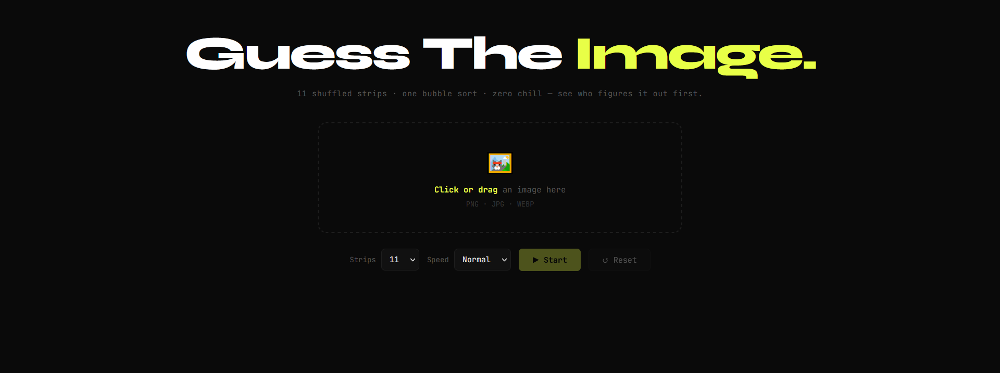
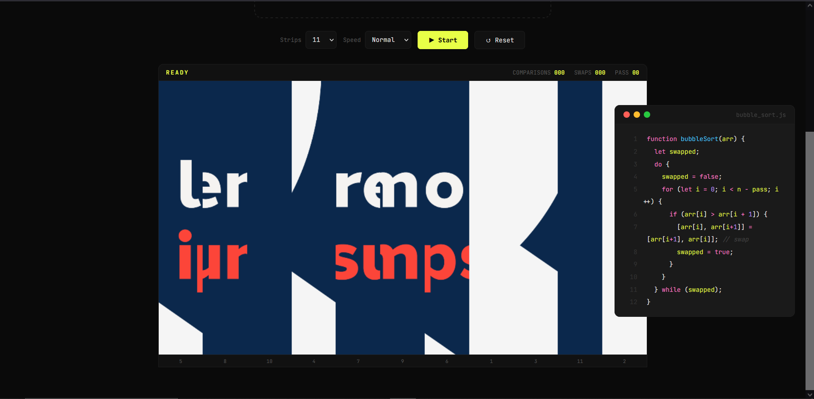
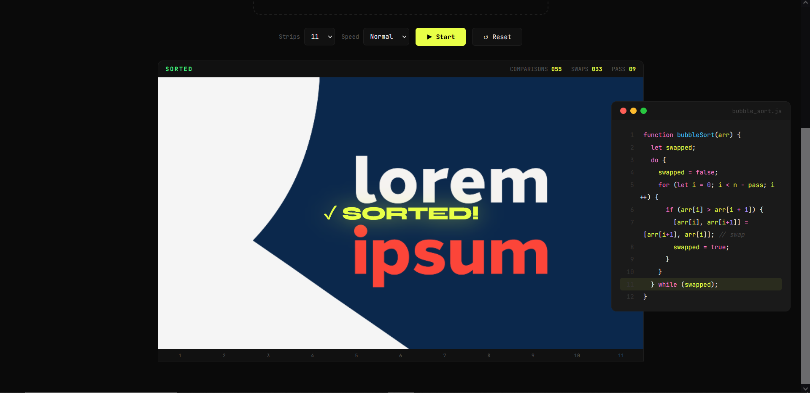

# 🖼️ stripsy

A sorting algorithm visualizer that slices your image into strips, shuffles them, and sorts them back live using bubble sort.

---

## 🚀 Live Demo

👉 https://praful77jha.github.io/stripsy/

---

## 🧑‍💻 About

stripsy is a creative take on algorithm visualization. Instead of boring bars or numbers, it uses your own image — slicing it into vertical strips, shuffling them into chaos, then watching bubble sort restore them back to the original, one swap at a time.

---

## ✨ Features

- Upload any image and watch it get sliced into strips
- Strips are shuffled randomly to start the visualization
- Bubble sort runs live, swapping strips step by step
- Visual and intuitive way to understand sorting algorithms
- Fully browser-based — no installs needed

---

## 🛠️ Tech Stack

- HTML5
- CSS3
- JavaScript (Vanilla)

---

## 📸 Preview

### 🏠 Home / Upload Screen

### 🔀 Shuffled Strips

### ✅ Sorted

---

## 📸 How It Works

1. Upload an image
2. The image is sliced into equal vertical strips
3. Strips are shuffled randomly
4. Bubble sort runs in real time, sorting strips back into place
5. Watch the image reconstruct itself!

---

## 📚 What I Learned

- Implementing bubble sort visually in the browser
- Working with the Canvas API / CSS transforms for image slicing
- Animating DOM elements in sync with algorithm steps
- Creative problem-solving with JavaScript

---

## 🔗 Links

- GitHub: https://github.com/Praful77Jha

---

Sorting algorithms, but make it visual 🚀
